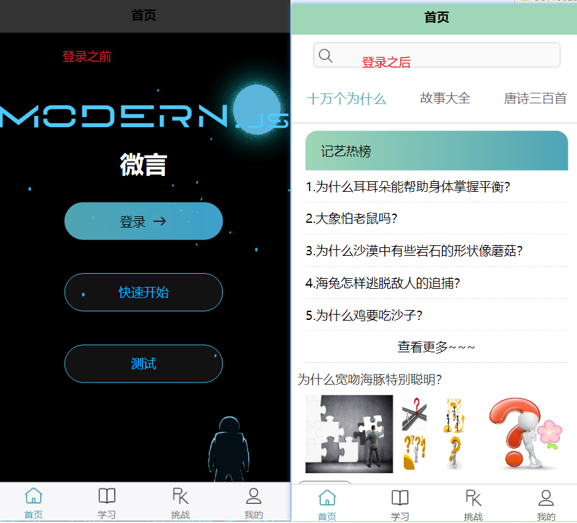
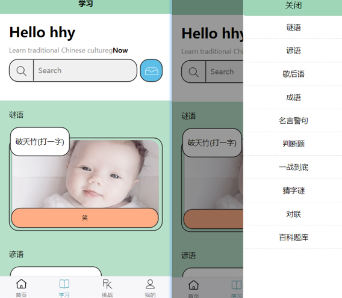
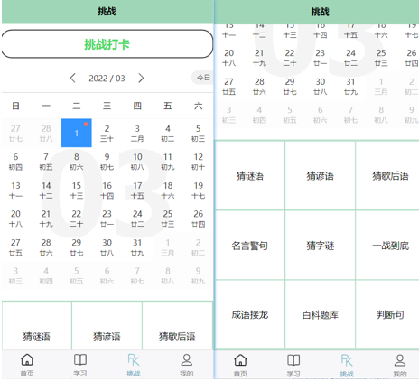
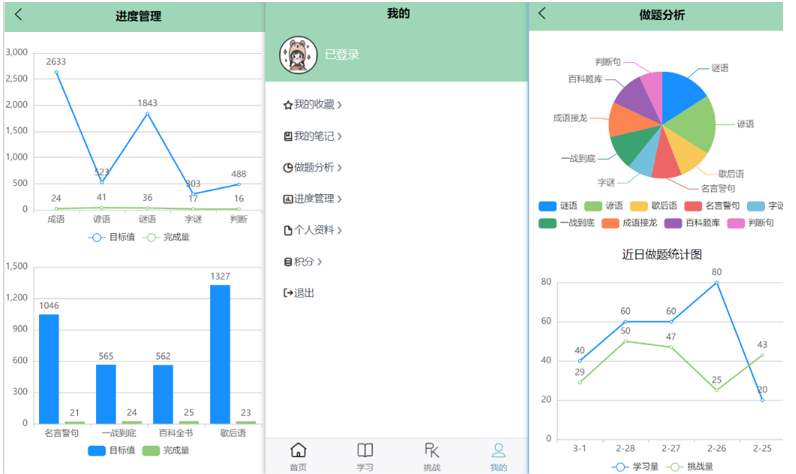

# app界面设计

### 代码提交

github仓库：

地址：https://github.com/tiantianhy/weiyan_app

git switch main

git remote add github https://github.com/tiantianhy/weiyan_app.git

 push -u github main

gitee仓库：

地址：[study-Traditional-culture-app: 毕设app (gitee.com)](https://gitee.com/tiantianhy/study-traditional-culture-app)

git switch master

git remote add origin https://github.com/tiantianhy/weiyan_app.git

 push -u origin master

### 插入图片路径显示问题

不显示

.\readme-image\image-20220508122710430.png

显示：

https://github.com/tiantianhy/weiyan_app/blob/main/readme-image/image-20220508122710430.png

./readme-image/image-20220508122710430.png

注意正反斜杆问题

### 界面设计如下：

首页：

学习页面：

挑战页面：

我的页面：

